# SyncEdit

Public release of the `src/run_sv3d_v6_exp.txt` pipeline with one runnable example:

- task: `replace`
- case: `girl -> girl_skirt`
- shipped source views: `assets/replace/girl/`
- shipped edited guide views: `assets/replace/girl_skirt/`

This repository provides the code path needed for the SV3D editing run, one public example case, the main pipeline PDF, and public qualitative result videos.

## Included Content

- `src/`: main SV3D editing code
- `src/run_sv3d_v6_exp.txt`: main run script
- `src/cases/replace_guide{1,2,3,4}.txt`: one public case under four guide settings
- `assets/replace/girl/`: 21 source multi-view frames
- `assets/replace/girl_skirt/`: 4 edited guide images
- `assets/demo_videos/guide3/`: public qualitative result videos
- `docs/main_pipeline.pdf`: main pipeline PDF
- `docs/pipeline_preview.png`: preview image for the pipeline

## Main Pipeline

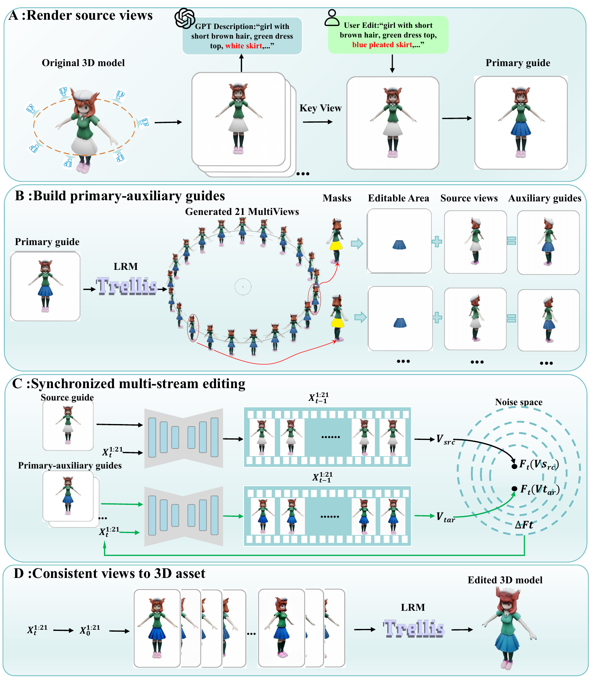

- PDF: [docs/main_pipeline.pdf](docs/main_pipeline.pdf)

## Environment

Linux + CUDA GPU is required. The current code path loads the SV3D editing pipeline in `float16` and will not run on CPU.

Suggested environment:

```bash
conda create -n syncedit python=3.10 -y
conda activate syncedit
pip install --upgrade pip
pip install -r requirements.txt
```

`xformers` is recommended in most CUDA environments for the SV3D model stack.

## Required Weights

This repository does not include model checkpoints.

Required:

- `checkpoints/sv3d_p.safetensors`

Optional local overrides:

- `ZERO123PLUS_MODEL_DIR` or `ZERO123PLUS_LOCAL_DIR`
- `INSTANTMESH_UNET_PATH` or `ZERO123PLUS_UNET_PATH`

If the overrides are not set, the code will try cached Hugging Face files and then fall back to downloading them.

## Public Example

Runnable case metadata:

- source text: `girl with short brown hair, green dress top, white skirt, knee-high socks, pink shoes, horn-like protrusions by head`
- edited text: `girl with short brown hair, green dress top, blue pleated skirt, knee-high socks, pink shoes, horn-like protrusions by head`
- edit instruction: `replace white skirt with blue pleated skirt`

Available guide presets for this one case:

- `guide1`: one edited guide image
- `guide2`: two edited guide images
- `guide3`: three edited guide images with explicit ownership
- `guide4`: four edited guide images

Default public run uses `guide2`.

## Run

From the repository root:

```bash
bash src/run_sv3d_v6_exp.txt
```

Equivalent explicit command:

```bash
CASE_IDS_STR="girl_skirt" \
CUDA_VISIBLE_DEVICES=0 \
DEVICE_NUMBER=0 \
PYTHON_BIN=python \
bash src/run_sv3d_v6_exp.txt guide2
```

Other guide settings for the same public case:

```bash
bash src/run_sv3d_v6_exp.txt guide1
bash src/run_sv3d_v6_exp.txt guide3
bash src/run_sv3d_v6_exp.txt guide4
```

Useful runtime overrides:

```bash
CUDA_VISIBLE_DEVICES=0 DEVICE_NUMBER=0 N_MAX=33 TAR_GUIDANCE_SCALE=4.0 bash src/run_sv3d_v6_exp.txt guide2
OVERWRITE=true bash src/run_sv3d_v6_exp.txt guide2
OUTPUT_ROOT=outputs/my_run bash src/run_sv3d_v6_exp.txt guide2
```

Outputs are written under:

```text
outputs/v6_exp_latentblend/guide{K}_nmax{N}/replace/girl_skirt/
```

Each finished run directory contains:

- `00.png` to `20.png`
- `preview.gif`
- `run_config.txt`

## Repository Layout

```text
SyncEdit/
├── assets/
│   ├── demo_videos/
│   └── replace/
├── checkpoints/
├── docs/
├── scripts/
├── sgm/
├── src/
├── README.md
└── requirements.txt
```

## Public Videos

### Add

<table class="center">
<tr>
  <td width="33%" align="center">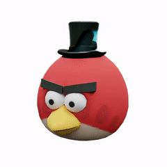</td>
  <td width="33%" align="center">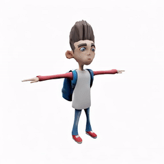</td>
  <td width="33%" align="center">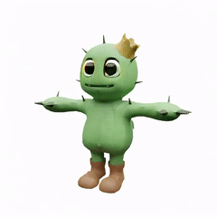</td>
</tr>
<tr>
  <td width="33%" align="center"><strong>bird_hat</strong></td>
  <td width="33%" align="center"><strong>boy17_bag</strong></td>
  <td width="33%" align="center"><strong>Cacnea_eye</strong></td>
</tr>
<tr>
  <td width="33%" align="center">Original: "red bird head with thick black eyebrows, white eyes, yellow beak"</td>
  <td width="33%" align="center">Original: "boy with spiky dark hair, white and red raglan shirt, blue jeans, red sneakers"</td>
  <td width="33%" align="center">Original: "green cactus creature with golden crown, spikes, brown shoes"</td>
</tr>
<tr>
  <td width="33%" align="center">Edited: "red bird head with thick black eyebrows, white eyes, yellow beak, tall black top hat"</td>
  <td width="33%" align="center">Edited: "boy with spiky dark hair, white and red raglan shirt, blue jeans, red sneakers, blue backpack"</td>
  <td width="33%" align="center">Edited: "green cactus creature with golden crown, spikes, brown shoes, round eyes"</td>
</tr>
</table>

<table class="center">
<tr>
  <td width="33%" align="center">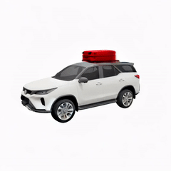</td>
  <td width="33%" align="center">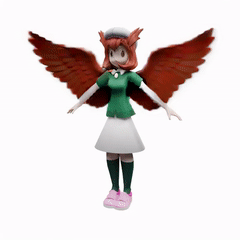</td>
  <td width="33%" align="center">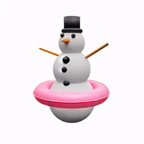</td>
</tr>
<tr>
  <td width="33%" align="center"><strong>car01_trunk</strong></td>
  <td width="33%" align="center"><strong>girl_wing</strong></td>
  <td width="33%" align="center"><strong>snowman_loop</strong></td>
</tr>
<tr>
  <td width="33%" align="center">Original: "white SUV"</td>
  <td width="33%" align="center">Original: "girl with short brown hair, green dress, white skirt, knee-high socks, pink shoes"</td>
  <td width="33%" align="center">Original: "white snowman with black top hat, carrot nose, black buttons, stick arms"</td>
</tr>
<tr>
  <td width="33%" align="center">Edited: "white SUV with red suitcase on roof"</td>
  <td width="33%" align="center">Edited: "girl with short brown hair, green dress, white skirt, knee-high socks, pink shoes, brown wings"</td>
  <td width="33%" align="center">Edited: "white snowman with black top hat, carrot nose, black buttons, stick arms, pink swim ring"</td>
</tr>
</table>

### Delete

<table class="center">
<tr>
  <td width="33%" align="center">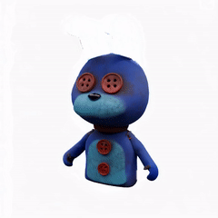</td>
  <td width="33%" align="center">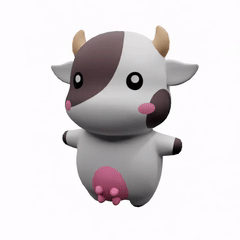</td>
  <td width="33%" align="center">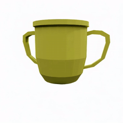</td>
</tr>
<tr>
  <td width="33%" align="center"><strong>bangni_ear</strong></td>
  <td width="33%" align="center"><strong>cow_tail</strong></td>
  <td width="33%" align="center"><strong>cup_base</strong></td>
</tr>
<tr>
  <td width="33%" align="center">Original: "blue rabbit doll with long upright ears, red button eyes, light blue belly, red torso buttons"</td>
  <td width="33%" align="center">Original: "white and brown cow with horns, pink cheeks, tail"</td>
  <td width="33%" align="center">Original: "gold trophy cup with two side handles and pedestal base"</td>
</tr>
<tr>
  <td width="33%" align="center">Edited: "blue rabbit doll with red button eyes, light blue belly, red torso buttons"</td>
  <td width="33%" align="center">Edited: "white and brown cow with horns and pink cheeks"</td>
  <td width="33%" align="center">Edited: "gold trophy cup with two side handles"</td>
</tr>
</table>

<table class="center">
<tr>
  <td width="33%" align="center">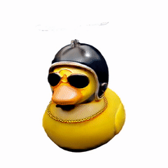</td>
  <td width="33%" align="center">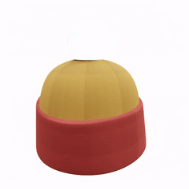</td>
  <td width="33%" align="center">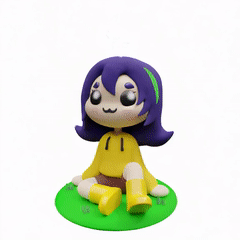</td>
</tr>
<tr>
  <td width="33%" align="center"><strong>duck_fan</strong></td>
  <td width="33%" align="center"><strong>hat_point</strong></td>
  <td width="33%" align="center"><strong>purplegirl_grass</strong></td>
</tr>
<tr>
  <td width="33%" align="center">Original: "yellow rubber duck wearing black aviator sunglasses, gold chain, black helicopter helmet with rotor"</td>
  <td width="33%" align="center">Original: "knit winter hat with red brim, yellow dome, round top pom-pom"</td>
  <td width="33%" align="center">Original: "seated girl with purple hair, yellow hoodie, blue flower or grass sprout growing from top of her head"</td>
</tr>
<tr>
  <td width="33%" align="center">Edited: "yellow rubber duck wearing black aviator sunglasses, gold chain, black helmet"</td>
  <td width="33%" align="center">Edited: "knit winter hat with red brim and yellow dome"</td>
  <td width="33%" align="center">Edited: "seated girl with purple hair and yellow hoodie"</td>
</tr>
</table>

### Replace

<table class="center">
<tr>
  <td width="33%" align="center">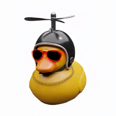</td>
  <td width="33%" align="center">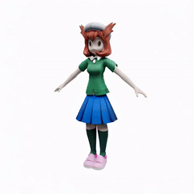</td>
  <td width="33%" align="center">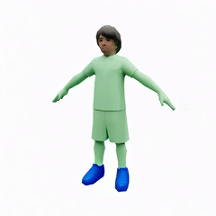</td>
</tr>
<tr>
  <td width="33%" align="center"><strong>duck_glasses</strong></td>
  <td width="33%" align="center"><strong>girl_skirt</strong></td>
  <td width="33%" align="center"><strong>gman_shoe1</strong></td>
</tr>
<tr>
  <td width="33%" align="center">Original: "yellow rubber duck wearing black aviator sunglasses, gold chain, black helmet with rotor"</td>
  <td width="33%" align="center">Original: "girl with short brown hair, green dress top, white skirt, knee-high socks, pink shoes, horn-like protrusions by head"</td>
  <td width="33%" align="center">Original: "green child with short dark hair and green shoes"</td>
</tr>
<tr>
  <td width="33%" align="center">Edited: "yellow rubber duck wearing red sunglasses, gold chain and black helmet with rotor"</td>
  <td width="33%" align="center">Edited: "girl with short brown hair, green dress top, blue pleated skirt, knee-high socks, pink shoes, horn-like protrusions by head"</td>
  <td width="33%" align="center">Edited: "green child with short dark hair and blue shoes"</td>
</tr>
</table>

<table class="center">
<tr>
  <td width="33%" align="center">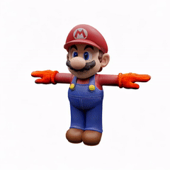</td>
  <td width="33%" align="center">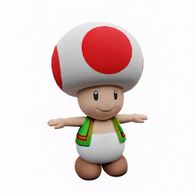</td>
  <td width="33%" align="center">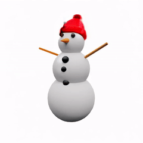</td>
</tr>
<tr>
  <td width="33%" align="center"><strong>mario_glove</strong></td>
  <td width="33%" align="center"><strong>mushroom_vest</strong></td>
  <td width="33%" align="center"><strong>snowman_hat</strong></td>
</tr>
<tr>
  <td width="33%" align="center">Original: "plumber with red hat, blue overalls, white gloves, black mustache"</td>
  <td width="33%" align="center">Original: "mushroom-headed character with white cap with red spots, blue vest, smiling face"</td>
  <td width="33%" align="center">Original: "white snowman with black top hat, carrot nose, black buttons, stick arms"</td>
</tr>
<tr>
  <td width="33%" align="center">Edited: "plumber with red hat, blue overalls, orange gloves, black mustache"</td>
  <td width="33%" align="center">Edited: "mushroom-headed character with white cap with red spots, green vest with red trim, smiling face"</td>
  <td width="33%" align="center">Edited: "white snowman with red knit beanie, carrot nose, black buttons, stick arms"</td>
</tr>
</table>
